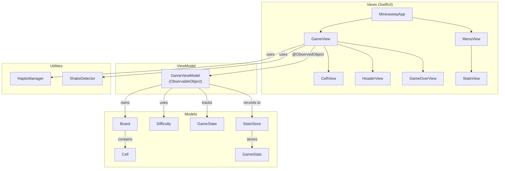

<div align="center">

# Minesweep

### A modern Minesweeper game for iOS, built entirely with Swift and SwiftUI.

[](https://github.com/irodrigo17/minesweep/stargazers)
[](https://github.com/irodrigo17/minesweep/network/members)

[](https://swift.org)
[](https://developer.apple.com/ios/)
[](https://developer.apple.com/swiftui/)
[](LICENSE)
[](#-testing)
[](#)

<br>

**Classic gameplay. Mobile-first design. Zero dependencies.**

[Features](#-features) · [Architecture](#-architecture) · [Getting Started](#-getting-started) · [Testing](#-testing) · [Project Structure](#-project-structure)

<br>

</div>

---

## Features

| Feature | Description |
|:--------|:------------|
| **Mobile-Optimized Boards** | Board sizes designed for portrait phone screens — no scrolling needed |
| **Three Difficulty Levels** | Beginner (9x9), Intermediate (12x12), Expert (16x10) with balanced mine densities |
| **Touch Gestures** | Tap to reveal, quick long-press (0.15s) to flag, tap revealed numbers to chord |
| **Smart Hints** | Shake the device for a hint — prioritizes logically deducible safe cells |
| **Stats Tracking** | Per-difficulty stats: wins, losses, win rate, best time, average time |
| **iCloud Sync** | Stats persist via `NSUbiquitousKeyValueStore` with `UserDefaults` fallback |
| **Haptic Feedback** | Tactile feedback on flag placement, hints, wins, and losses |
| **Accessibility** | Full VoiceOver support with per-cell labels and hints |
| **First-Tap Safety** | Mines placed after first tap — tapped cell and neighbors are always safe |
| **Flood Fill Reveal** | Tapping an empty cell cascades to reveal the entire safe region |
| **Chord Support** | Tap a revealed number with correct flags to auto-reveal remaining neighbors |

---

## Difficulty Levels

| Level | Grid | Mines | Density | Designed For |
|:------|:----:|:-----:|:-------:|:-------------|
| **Beginner** | 9 x 9 | 10 | 12.3% | Quick games, learning |
| **Intermediate** | 12 x 12 | 22 | 15.3% | Balanced challenge |
| **Expert** | 16 x 10 | 32 | 20.0% | Experienced players |

> Board sizes are optimized for mobile portrait screens, departing from the classic desktop sizes (9x9, 16x16, 16x30) which require scrolling on phones.

---

## Architecture

The app follows the **MVVM** (Model-View-ViewModel) pattern with clear separation of concerns:



### Layer Responsibilities

| Layer | Role | Framework Dependencies |
|:------|:-----|:----------------------|
| **Models** | Pure game logic — board state, mine placement, flood fill, win/loss detection, stats | `Foundation` only |
| **ViewModel** | Bridges model to views — game actions, timer, hint logic, stat recording | `Foundation`, `SwiftUI` (for `ObservableObject`) |
| **Views** | Declarative UI — grid rendering, gestures, animations, accessibility | `SwiftUI` |
| **Utilities** | Haptic feedback, shake detection | `UIKit` |

### Key Algorithms

```
Mine Placement (deferred to first tap)
├── Build exclusion zone: tapped cell + 8 neighbors
├── Collect all non-excluded positions
├── Shuffle and pick first N positions
└── Compute adjacent mine counts for all cells

Flood Fill (BFS, iterative)
├── Start from revealed cell with adjacentMines == 0
├── Queue-based breadth-first search
├── Reveal each hidden neighbor
├── If neighbor also has adjacentMines == 0, enqueue it
└── Stops at numbered cells and flagged cells

Smart Hint (3-tier priority)
├── 1. Logically deducible: cells provably safe from visible numbers + flags
├── 2. Frontier: hidden cells adjacent to revealed cells
└── 3. Fallback: any hidden non-mine cell
```

---

## Getting Started

### Prerequisites

- **Xcode 15+**
- **iOS 17.0+** deployment target
- No third-party dependencies — just clone and build

### Build & Run

```bash
# Clone the repository
git clone https://github.com/irodrigo17/minesweep.git
cd minesweep

# Open in Xcode
open Minesweep.xcodeproj

# Or build from command line
xcodebuild -project Minesweep.xcodeproj \
  -scheme Minesweep \
  -destination 'platform=iOS Simulator,name=iPhone 16' \
  -configuration Debug build
```

### iCloud Stats Sync (Optional)

To enable cross-device stat syncing:

1. Select the **Minesweep** target in Xcode
2. Go to **Signing & Capabilities**
3. Add **iCloud** capability
4. Check **Key-Value Storage**

> Stats work locally without this — iCloud sync requires a paid Apple Developer account.

---

## Testing

### Test Suite Overview

The project includes **80 tests** across 6 test files — 69 unit tests covering core game logic and 11 UI tests verifying end-to-end user flows:

```
MinesweepTests/
├── BoardTests.swift          36 tests
├── GameViewModelTests.swift  15 tests
├── GameStatsTests.swift       7 tests
├── StatsStoreTests.swift      6 tests
└── DifficultyTests.swift      5 tests
                              ─────────
                              69 unit tests

MinesweepUITests/
└── MinesweepUITests.swift    11 tests
                              ─────────
                              11 UI tests
```

### Run Tests

```bash
# Via Xcode
# Cmd+U

# Via command line
xcodebuild -project Minesweep.xcodeproj \
  -scheme Minesweep \
  -destination 'platform=iOS Simulator,name=iPhone 16' \
  test
```

### Coverage Breakdown

| Test File | Tests | What's Covered |
|:----------|:-----:|:---------------|
| **BoardTests** | 36 | Mine placement (count, first-tap safety, neighbor exclusion, deterministic via seeded RNG, idempotent), adjacent mine counts, reveal (safe/mine/flagged/already-revealed/invalid coordinates), flood fill (empty region cascade, stops at numbers, skips flagged cells), flagging (toggle, revealed cell ignored, invalid coordinates, remaining count, incremental tracking, negative remaining), chord (correct flags, wrong flags, flag mismatch, invalid coordinates, hidden/flagged/zero-adjacent edge cases), win detection, all mines revealed on loss, neighbor counts (corner/edge/center), revealed count accuracy (single reveal, flood fill, chord, mine loss) |
| **GameViewModelTests** | 15 | State transitions (idle -> playing -> won/lost), actions blocked after game over (reveal, flag, chord), flagging before first reveal, `newGame()` reset, difficulty change, hint system (blocked in idle, blocked after game over, returns safe cell, prefers logically deducible cells, no repeat while active) |
| **StatsStoreTests** | 6 | `StatsRecording` protocol verification, ViewModel stats integration (win/loss recording via injected mock, correct difficulty tracking, no stats on safe reveal) |
| **GameStatsTests** | 7 | Initial state, record win, record loss, best time tracks minimum, average win time, win rate accuracy, `Codable` encode/decode round-trip |
| **DifficultyTests** | 5 | Beginner/Intermediate/Expert preset values, mine count < total cells invariant, `allCases` count |
| **MinesweepUITests** | 11 | Menu display (difficulty buttons, statistics button), navigation (to game, back to menu), cell reveal on tap, flag mode (toggle, flags cell), reset button, statistics view (open/close), difficulty labels shown in game (beginner/intermediate/expert) |

---

## Project Structure

```
minesweep/
├── Minesweep.xcodeproj/
├── Minesweep/
│   ├── App/
│   │   └── MinesweepApp.swift              # @main entry point + navigation
│   ├── Models/
│   │   ├── Cell.swift                      # Cell struct + CellState enum
│   │   ├── GameState.swift                 # Game lifecycle enum
│   │   ├── Difficulty.swift                # Difficulty presets
│   │   ├── Board.swift                     # Game engine: mines, reveal, flood fill, chord
│   │   ├── GameStats.swift                 # Per-difficulty statistics
│   │   └── StatsStore.swift                # iCloud + UserDefaults persistence
│   ├── ViewModels/
│   │   └── GameViewModel.swift             # Game state, timer, hints, actions
│   ├── Views/
│   │   ├── CellView.swift                  # Cell rendering + shimmer hint animation
│   │   ├── HeaderView.swift                # Mine counter, reset button, timer
│   │   ├── MenuView.swift                  # Difficulty selection + stats access
│   │   ├── GameView.swift                  # Main game screen + gestures
│   │   ├── GameOverView.swift              # Win/loss overlay
│   │   └── StatsView.swift                 # Per-difficulty statistics display
│   ├── Utilities/
│   │   ├── HapticManager.swift             # Haptic feedback wrapper
│   │   └── ShakeDetector.swift             # Device shake detection
│   └── Assets.xcassets/
├── MinesweepTests/
│   ├── BoardTests.swift                    # 36 tests
│   ├── GameViewModelTests.swift            # 15 tests
│   ├── StatsStoreTests.swift               #  6 tests
│   ├── GameStatsTests.swift                #  7 tests
│   └── DifficultyTests.swift               #  5 tests
├── MinesweepUITests/
│   └── MinesweepUITests.swift              # 11 UI tests
└── README.md
```

---

## Tech Stack

| Component | Technology |
|:----------|:-----------|
| **Language** | Swift 5 |
| **UI Framework** | SwiftUI |
| **Architecture** | MVVM |
| **Persistence** | `NSUbiquitousKeyValueStore` + `UserDefaults` |
| **Haptics** | `UIImpactFeedbackGenerator` / `UINotificationFeedbackGenerator` |
| **Minimum Target** | iOS 17.0 |
| **Dependencies** | None |

---

<div align="center">

**Built with Swift and SwiftUI. No third-party dependencies.**

<br>

If you enjoy the game, consider giving it a star!

[](https://github.com/irodrigo17/minesweep)

</div>
